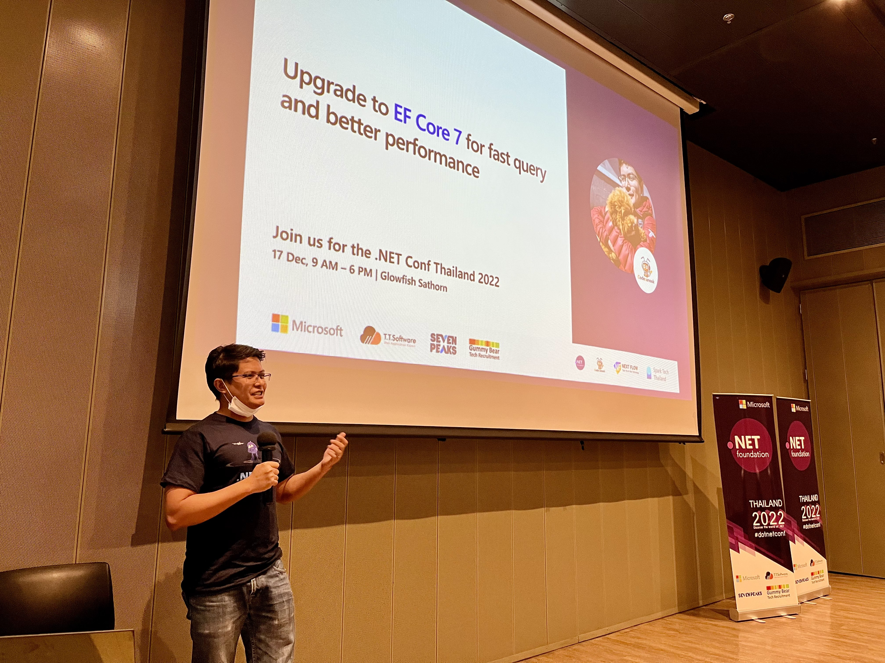

# Slide
[Upgrade to EF Core 7  for fast query and better performance - .NET Conf 2022](https://docs.google.com/presentation/d/1uPs_LV2ulAcWr1UuXA54dFzrizn1WH29cZmG29W2CJ0/edit#slide=id.g1bb543cc0cc_0_0)

# Source code
[codesanook-ef-note](https://github.com/codesanook/codesanook-ef-note)

# Photos 

